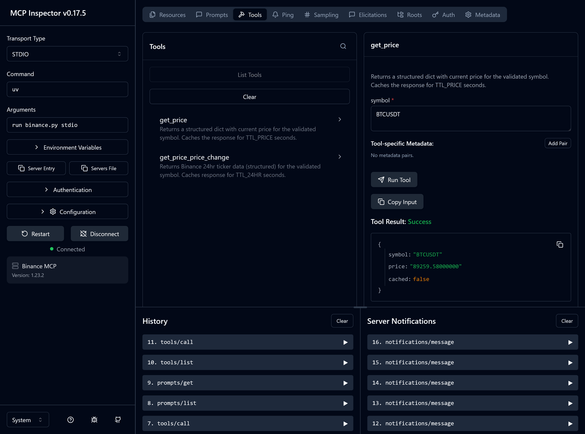

# Binance MCP Server 🚀

A **FastMCP (Model Context Protocol) server** that provides real-time and cached cryptocurrency data from **Binance**, with:

- 🔍 **Symbol resolution** (`btc`, `bitcoin` → `BTCUSDT`)
- 🔁 **Automatic retries** with exponential backoff
- 🚦 **Rate-limit handling** (HTTP 429)
- ⚡ **TTL-based caching**
- 📝 **Activity logging**
- 🧩 **Structured MCP tools, prompts, and resources**

# 📸 Screenshots

## 💰 BTC Price, 24-Hour Change & Executive Crypto Summary

  

  

  

  

## 💰 BTC price fetched via MCP Inspector

  

